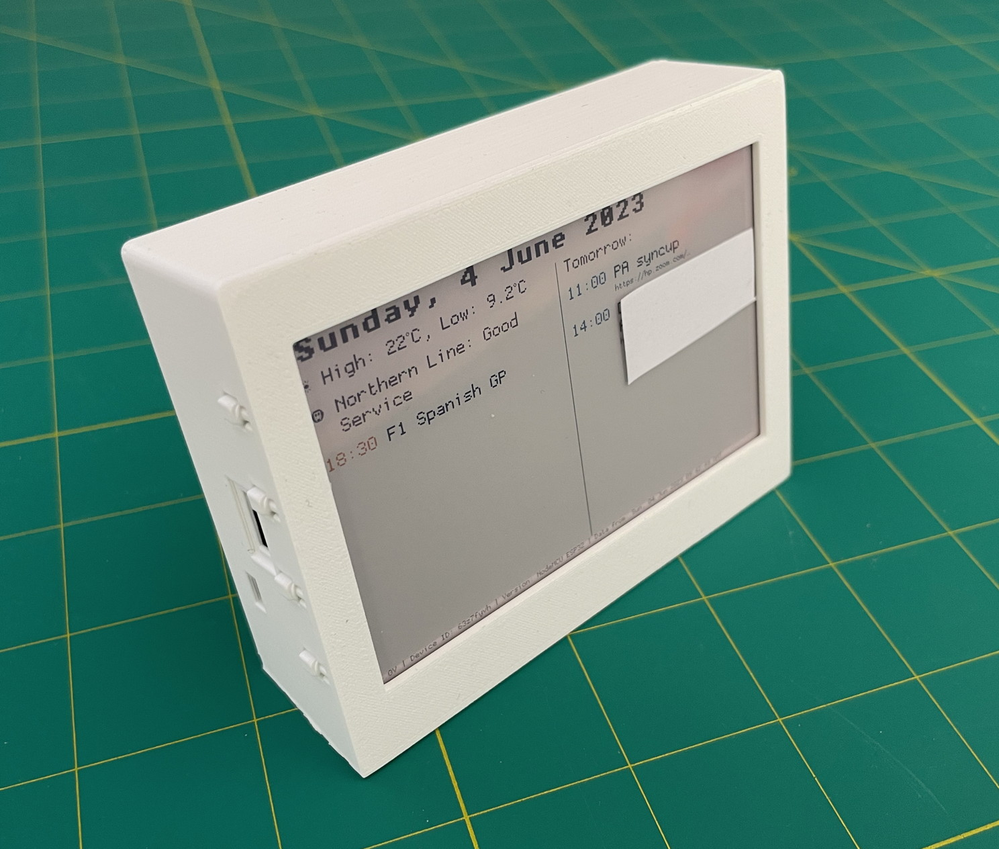
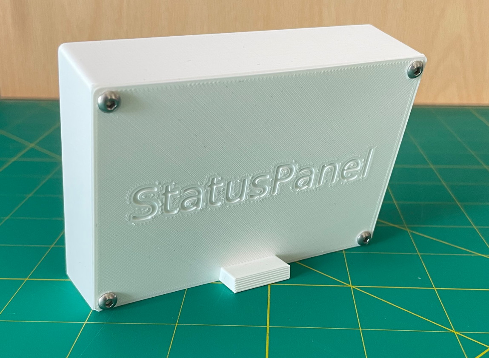

inky-statuspanel-case
---------------------

A 3D printed case for [StatusPanel](https://github.com/inseven/statuspanel) v2.

Original model is in the `*.slvs` files, created with [SolveSpace](https://solvespace.com/).

`.stl` files generated by SolveSpace.

The `.gcode` files are for the Creality Ender 3 Pro created with [Ultimaker Cura](https://ultimaker.com/software/ultimaker-cura/).

